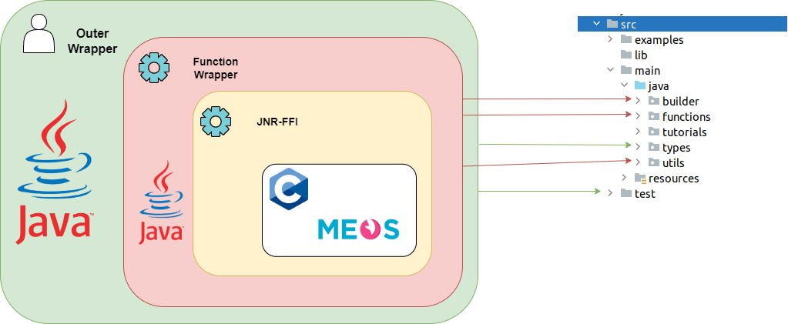
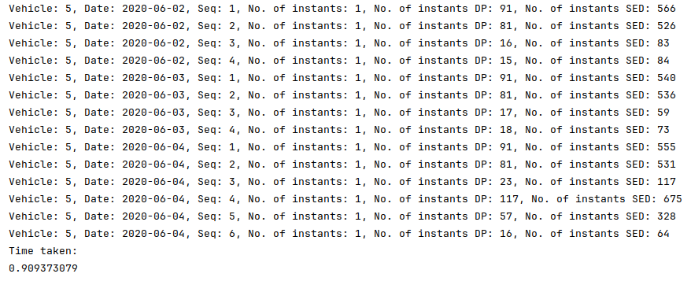
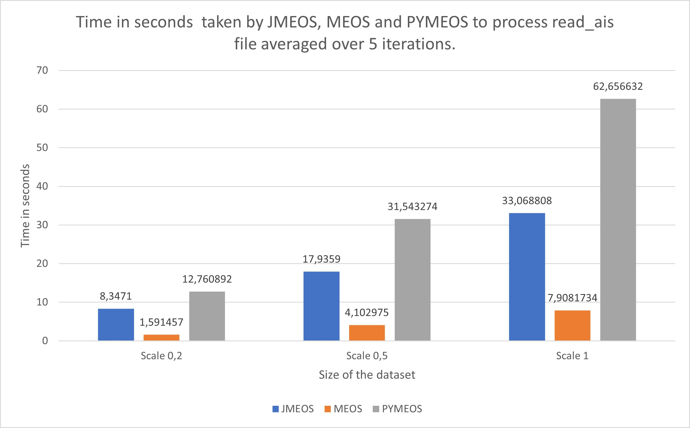
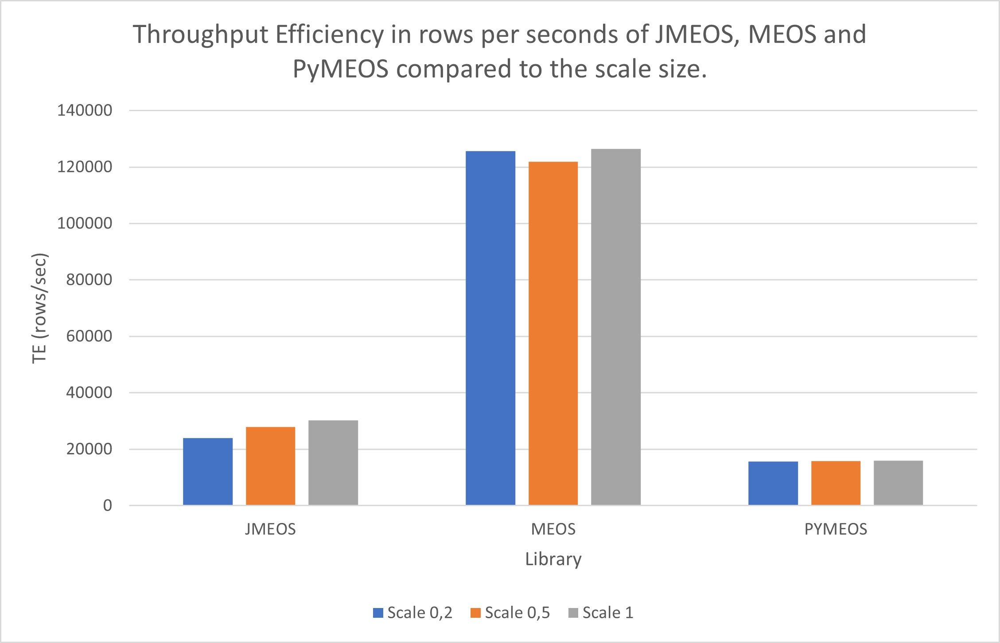

# JMEOS
**Author:** Mareghni Nidhal
**Email:** nidhalmareghni8@gmail.com

JMEOS library for MobilityDB has been performed as the Master Thesis of the MSc in Computer Science of ULB.
A report with the detailed informations is available in the thesis [folder](https://github.com/nmareghn/MobilityDB-JMEOS/tree/test/thesis).

## Abstract

The increasing complexity and volume of spatiotemporal data in various domains necessitate efficient and accessible tools for data handling and analysis. MobilityDB, an open-source moving object database, has established itself as a pioneer tool in this landscape. However, with the emergence of big data, there’s an urgent requirement to exploit MobilityDB’s capabilities, through widely used programming languages, such as Python and Java. It’s within this context that JMEOS, a Java-based library, becomes relevant. It bridges the gap between Java applications and MobilityDB, allowing for the seamless integration of advanced temporal types and functionalities. The main focus of this thesis is the implementation of a Java binding of the MEOS library. To this end, we map the functionalities through JNR-FFI, a popular C foreign function interface. By means of it, we implement analogous MobilityDB spatiotemporal types such as TBox, FloatSpan, PeriodSet or TGeomPoint. Lastly, we perform unit tests and code analysis to ensure the functionality and reliability of JMEOS . We finish the thesis by implementing use case example to demonstrate its efficacy in real-world scenarios and benchmarking its performance against MobilityDB and MEOS.

## Table of contents

- [Requirements](#Requirements)
- [Installation](#Installation)
- [Javadoc](#Javadoc)
- [Unit Test](#Unit-Test)
- [Deployment](#Deployment)
- [Code Analysis](#Code-Analysis)
- [Docker Image](#Docker-Image)
- [Use Case Example](#Use-Case-Example)
- [Future Work](#Future-Work)

## Requirements
The project is based on MEOS and developed in Java
- 🚀 MobilityDB with MEOS
- 📝 Maven 3.9.6
- ☕ Java 21
### Dependencies
The following dependencies are obtained through Maven and are necessary to develop JMEOS.
- 🔗 JNR-FFI
- 🛠️ Maven Plugin
- ✅ JUnit
- 🌍 Jts Core
### Structure of the project
The project is based on two layer of wrapper. The function wrapper uses JNR-FFI to transform MEOS API functions in Java functions. The outer wrapper uses the functions wrapper to define spatiotemporal classes and methods written in Java.
The structure of the project is displayed in the following figure:
<br/><br/>


## Installation
### MobilityDB
Installation of Java and Maven will not be detailed here since many tutorials exists online. The installation of MobilityDB with MEOS needs to follow these subsequent commands: 

```bash
#Install MobilityDB with MEOS
git clone https://github.com/MobilityDB/MobilityDB
mkdir MobilityDB/build
cd MobilityDB/build
cmake -DMEOS=on ..
make
sudo make install
```
### Dependencies
Concerning the dependencies, all of them were already included in the pom.xml file. It is highly recommended to use an IDE such as IntelliJ in order to seamlessly integrated all the components in the development environment.


## Javadoc
The Javadoc generated is available under the docs folder. 
It can be generated through the following command:
```bash
mvn javadoc:javadoc
```

By default, the generated javadoc will be stored inside the **target** folder.

## Unit test
Multiple unit test were implemented and are located under the **test** folder. The folder is structured similarly to the source file, as enforced by Java/IntelliJ rules. 
The following command allows to run all test at once:
```bash
mvn test
```
One can prefer running only one file (class):
```bash
mvn test -Dtest="FileTest"
```
It is also possible to run only one method of a class:
```bash
mvn test -Dtest="FileTest#method"
```


## Deployment
A dedicated self-explanatory file describing how the project can be deployed through a **jar** file, is stored [here].

## Code analysis
The code analysis is performed through SonarQube. In order to install it, the following set of commands needs to be run through command line:
```bash
# 1. Download and Install SonarQube
sudo apt - get install zip -y
sudo wget https://binaries.sonarsource.com/Distribution/sonarqube/sonarqube-9.6.1.59531.zip
sudo unzip sonarqube -9.6.1.59531.zip
sudo mv sonarqube -9.6.1.59531 sonarqube
sudo mv sonarqube/opt/

# 2. Add SonarQube Group and User
sudo groupadd sonar
sudo useradd -d /opt/sonarqube -g sonar sonar
sudo chown sonar : sonar /opt/sonarqube -R

# 3. Configure SonarQube
sudo nano/opt/sonarqube/conf/sonar.properties
# Edit with sonar username , password and url
sudo nano/opt/sonarqube/bin/linux-x86-64/sonar.sh
# Add sonar user

# 4. Setup Systemd service
sudo nano/etc/systemd/system/sonar.service
# Add service configuration of sonar
sudo systemctl enable sonar
sudo systemctl start sonar
sudo systemctl status sonar

# 5. Modify Kernel System Limits
sudo nano/etc/sysctl.conf
# Increase limit
sudo reboot

# 6. Access SonarQube Web Interface
# Access through http://IP:9000
```

When SonarQube is properly installed in the system, running the code analysis is straigthforward:
```bash
#Running code analysis
mvn clean verify sonar:sonar -Dsonar.projectKey=JMEOS -Dsonar.host.url=http://localhost:9000 -Dsonar.login=#yourtoken
```

## Docker image
In order to improve the portability of JMEOS library, a docker image was created. The docker image include a JMEOS, a linux environment as well as the installation of all requirements and dependencies of the project. This latter is available in an other repository located  [here](https://github.com/nmareghn/Docker-JMEOS/tree/main).
Docker 24.0.7 needs to be installed. Many tutorials online detail this process.

To clone it, please run this command:
```bash
git clone https://gitlab.com/asded/docker_mobilitydb-jmeos
cd docker_mobilitydb-jmeos/.devcontainer
```
To build the docker image, browse to the image directory:
```bash
docker build -t mbjmeos:lasted .
```

To run the docker image and use the following command:
```bash
docker run -ti mbjmeos:lasted
```

## Use Case Example
Multiple use case example are stored inside the **tutorials** package of the project. These examples manipulated BerlinMOD or AIS (from danish maritime institute) data.
For example:
- **hello_world.java**: manipulates TGeomPoint and transform them in mf-json strings format. 
- **read_ais.java**: reads AIS csv file containing ships locations and speed, extract the data and create JMEOS spatiotemporal type from these data in order to output the MMSI, Instants and SOG. 
- **simplify_berlinmod**: reads a BerlinMOD csv file containing trips, parse and extract data to create JMEOS  spatiotemporal types and then simplify these trips before outputting the results.

In the following figure, the output obtained from the simplify_berlinmod file execution:
<br/><br/>



To run the examples, it is necessary to execute the following command:
```bash
#Compile the java file
javac -cp  "path/to/jmeos.jar" tutorials/hello_world.java
#Run the java file
java -cp ".:path/to/jmeos.jar" tutorials.hello_world
```
Again it is highly recommended to use IntelliJ or similar tools that seamlessly integrates and coordinates all dependencies. Thus, if you use IntelliJ, then simply run it through the GUI application.

All files containing the data used in the use case example files are located in the resources directory.


### Benchmark
A small benchmark was performed on the read_ais.java file in order to compare the runtime performance with PyMEOS (Python implementation of MEOS) and MEOS. This benchmark was performed over 5 iterations and with 3 scales (200k, 500k and 1M lines) on AIS data obtained from [Danish AIS data](https://dma.dk/safety-at-sea/navigational-information/ais-data).

Below, two graphs representing the results obtained from this benchmark.

<br/><br/>


<br/><br/>


## Future Work
-  **Error Handling Improvements**  
	- Address limitations in JNR-FFI documentation and debuggability. 
	- Enhance error handling in JMEOS for better debugging, especially with C library interfacing.
	- Aim for more informative feedback at the Java-native C code boundary, enhancing JMEOS robustness and     user-friendliness. 
-  **Test Coverage Improvements**  
	- Increase test coverage in future JMEOS iterations for improved reliability. 
	- While 100% coverage was not achievable within the thesis timeline, it remains a recommended goal. 
-  **Implementation of Remaining Methods**  
    - Complete the implementation of remaining JMEOS methods to achieve full library potential. 
    - Ensures JMEOS fully encapsulates MEOS C library functionality, broadening use case applicability. 
 -  **Addition of New Examples/Visual Examples**  
    - Implement additional example files using real-world data to demonstrate JMEOS functionalities. 
    - Create a diverse set of examples for applications like urban planning, environmental monitoring, and GIS. 
-  **Creation of New MEOS Bindings**  
    - Develop new bindings for languages such as C and JavaScript, expanding MobilityDB's developer community.          
    - Support diverse applications and foster a more inclusive user base, contributing to spatiotemporal data processing knowledge.
