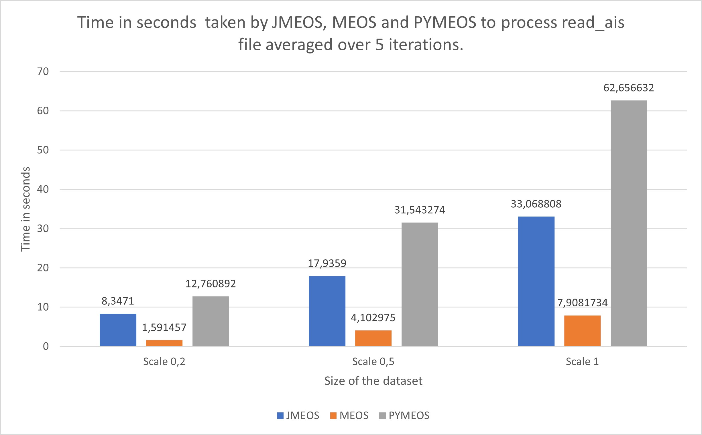
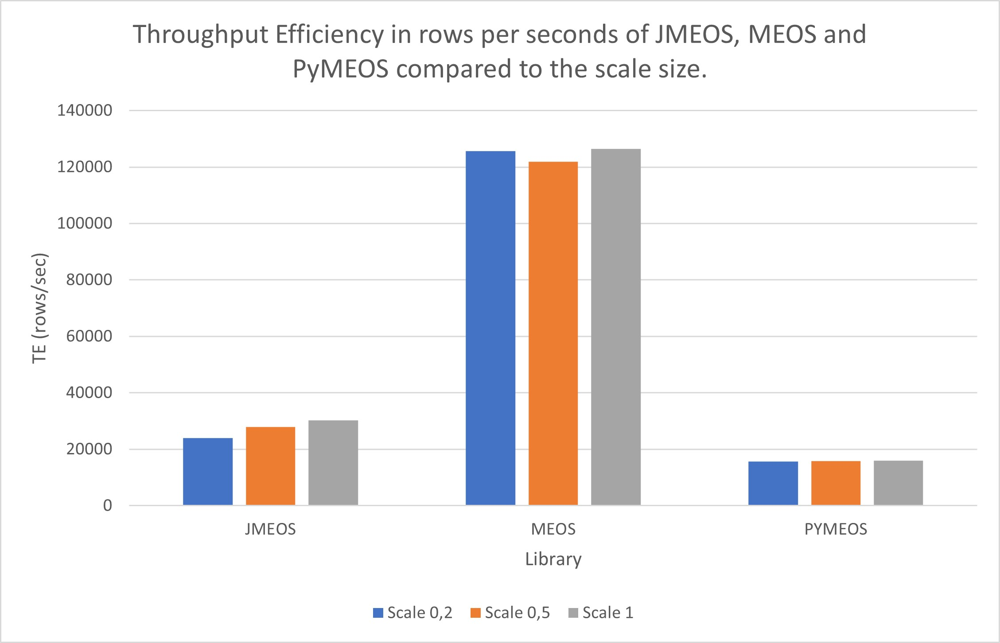

# JMEOS

## Abstract

The increasing complexity and volume of spatiotemporal data in various domains necessitate 
efficient and accessible tools for data handling and analysis. MobilityDB, an open-source moving 
object database, has established itself as a pioneer tool in this landscape. However, with the emergence of big data, 
there's an urgent requirement to exploit MobilityDB's capabilities, through widely used programming languages, such as 
Python and Java. It's within this context that JMEOS, a Java-based library, becomes relevant. It bridges the gap between
Java applications and MobilityDB, allowing for the seamless integration of advanced temporal types and functionalities. 

## Table of contents

- [Requirements](#Requirements)
- [Project Structure](#Project-Structure)
- [Installation](#Installation)
- [Code Generation](#Code-Generation)
- [Compilation](#Compilation)
- [Unit Tests](#Unit-Tests)
- [Deployment](#Deployment)
- [Javadoc](#Javadoc)
- [Code Analysis](#Code-Analysis)
- [Docker Image](#Docker-Image)
- [Use Case Examples](#Use-Case-Examples)
- [Future Work](#Future-Work)

## Requirements
The project is based on MEOS and developed in Java
- MobilityDB with MEOS
- Maven 3.9.6
- Java 21

### Dependencies
The following dependencies are obtained through Maven and are necessary to develop JMEOS.
- JNR-FFI
- Maven Plugin
- JUnit

## Project Structure

JMEOS is organized as a **multi-module Maven project**:

```
JMEOS/
├── codegen/                         ← Code generator module
│   ├── input/
│   │   └── meos-idl.json            ← MEOS API description (input for generator)
│   ├── src/main/java/
│   │   └── NewFunctionsGenerator.java
│   └── pom.xml
├── jmeos-core/                      ← Main JMEOS library module
│   ├── src/
│   │   ├── main/java/               ← Library source code
│   │   │   ├── functions/           ← Generated MEOS bindings (shouldn't be edited manually)
│   │   │   ├── types/               ← Spatiotemporal types
│   │   │   └── utils/
│   │   └── test/java/               ← Unit tests
│   └── pom.xml
└── pom.xml                          ← Root aggregator (packaging: pom)
```

The two-layer architecture consists of:
- **`codegen`**: reads `meos-idl.json` and generates `functions/GeneratedFunctions.java`
- **`jmeos-core`**: implements the spatiotemporal types on top of the generated bindings

## Installation

### MobilityDB
Installation of Java and Maven will not be detailed here since many tutorials exist online. The installation of MobilityDB with MEOS needs to follow these subsequent commands:

```bash
git clone https://github.com/MobilityDB/MobilityDB
mkdir MobilityDB/build
cd MobilityDB/build
cmake -DMEOS=on ..
make
sudo make install
```

### Copy the native library
`libmeos.so` must be placed in `jmeos-core/src/` so that `JarLibraryLoader` can find it:

```bash
cp /usr/local/lib/libmeos.so jmeos-core/src/libmeos.so
```

### Dependencies
All dependencies are declared in `jmeos-core/pom.xml` and resolved automatically by Maven. It is recommended to use an IDE such as IntelliJ to seamlessly integrate all components.

## Code Generation

The `codegen` module contains the generator that produces `functions/GeneratedFunctions.java` from the MEOS API description file (`codegen/input/meos-idl.json`).

**When to regenerate**: whenever `meos-idl.json` is updated (e.g. after a MEOS version upgrade).

### Run the generator

```bash
mvn compile exec:java -pl codegen -Dexec.mainClass="NewFunctionsGenerator"
```

This reads `codegen/input/meos-idl.json` and overwrites `jmeos-core/src/main/java/functions/GeneratedFunctions.java`.

> **Do not edit `GeneratedFunctions.java` manually**: any manual change will be lost the next time the generator is run.

### Update the input file

To update the MEOS API description, replace `codegen/input/meos-idl.json` with the new version and re-run the generator.

## Compilation

### Compile all modules

```bash
mvn clean compile
```

### Compile a specific module

```bash
# Compile only jmeos-core ("-am" also compiles parent if needed)
mvn clean compile -pl jmeos-core -am

# Compile only codegen
mvn clean compile -pl codegen -am
```

### Build the JARs

```bash
# Build all modules
mvn clean package -DskipTests

# Build only jmeos-core (normal jar + fat jar)
mvn package -pl jmeos-core -am -DskipTests
```

The generated JARs are placed in the `jar/` folder at the root:
- `jar/JMEOS.jar`: standard jar (without dependencies)
- `jar/JMEOS-fat.jar`: fat jar (all dependencies bundled)

## Unit Tests

Unit tests are located in `jmeos-core/src/test/java/`.

### Run all tests

```bash
mvn test
```

### Run tests for a specific module only

```bash
# Tests of jmeos-core only
mvn test -pl jmeos-core

# Tests of codegen only
mvn test -pl codegen
```

### Run a specific test class or method

```bash
# Run all tests in a class
mvn test -pl jmeos-core -Dtest="ClassName"

# Run a specific method
mvn test -pl jmeos-core -Dtest="ClassName#methodName"
```

## Javadoc

The Javadoc can be generated with:

```bash
# Generate for all modules
mvn javadoc:javadoc

# Generate for jmeos-core only
mvn javadoc:javadoc -pl jmeos-core
```

By default, the generated Javadoc will be stored inside the `target/` folder of each module.

## Code Analysis

The code analysis is performed through SonarQube. In order to install it, the following set of commands needs to be run through command line:
```bash
# 1. Download and Install SonarQube
sudo apt - get install zip -y
sudo wget https://binaries.sonarsource.com/Distribution/sonarqube/sonarqube-9.6.1.59531.zip
sudo unzip sonarqube -9.6.1.59531.zip
sudo mv sonarqube -9.6.1.59531 sonarqube
sudo mv sonarqube/opt/

# 2. Add SonarQube Group and User
sudo groupadd sonar
sudo useradd -d /opt/sonarqube -g sonar sonar
sudo chown sonar : sonar /opt/sonarqube -R

# 3. Configure SonarQube
sudo nano/opt/sonarqube/conf/sonar.properties
# Edit with sonar username , password and url
sudo nano/opt/sonarqube/bin/linux-x86-64/sonar.sh
# Add sonar user

# 4. Setup Systemd service
sudo nano/etc/systemd/system/sonar.service
# Add service configuration of sonar
sudo systemctl enable sonar
sudo systemctl start sonar
sudo systemctl status sonar

# 5. Modify Kernel System Limits
sudo nano/etc/sysctl.conf
# Increase limit
sudo reboot

# 6. Access SonarQube Web Interface
# Access through http://IP:9000
```

When SonarQube is properly installed in the system, running the code analysis is straightforward:
```bash
mvn clean verify sonar:sonar \
  -pl jmeos-core \
  -Dsonar.projectKey=JMEOS \
  -Dsonar.host.url=http://localhost:9000 \
  -Dsonar.login=#yourtoken
```

## Docker Image

A Docker image is available to run JMEOS in a portable Linux environment with all dependencies pre-installed.

```bash
# Clone the repository
git clone https://github.com/MobilityDB/JMEOS.git
cd JMEOS

# Build the Docker image
docker build -t jmeos:latest .

# Run the container (replace the path)
docker run -it --name jmeos \
  -v absolute/path/to/JMEOS:/usr/local/jmeos \
  jmeos:latest /bin/bash
```

> Use case examples have been moved to a dedicated repository: [JMEOS-Examples](https://github.com/MobilityDB/JMEOS-examples).

## Use Case Examples

Use case examples have been moved to the [JMEOS-Examples](https://github.com/MobilityDB/JMEOS-examples) repository. This separation keeps the core library focused while providing a standalone environment to run and extend the examples.

Examples include programs using BerlinMOD and AIS (Danish Maritime Institute) data, as well as Jupyter notebooks. Please refer to the [EXAMPLES_GUIDE.md](https://github.com/MobilityDB/JMEOS-examples/blob/main/EXAMPLES_GUIDE.md) and [JUPYTER_NOTEBOOKS_GUIDE.md](https://github.com/MobilityDB/JMEOS-examples/blob/main/JUPYTER_NOTEBOOKS_GUIDE.md) in that repository for full instructions.

### Benchmark

A small benchmark was performed on the `read_ais` program comparing runtime performance with PyMEOS (Python) and MEOS, over 5 iterations at 3 scales (200k, 500k and 1M lines) on AIS data from [Danish AIS data](https://dma.dk/safety-at-sea/navigational-information/ais-data).

<br/><br/>


<br/><br/>


## Future Work
-  **Error Handling Improvements**
    - Address limitations in JNR-FFI documentation and debuggability.
    - Enhance error handling in JMEOS for better debugging, especially with C library interfacing.
    - Aim for more informative feedback at the Java-native C code boundary, enhancing JMEOS robustness and user-friendliness.
-  **Test Coverage Improvements**
    - Increase test coverage in future JMEOS iterations for improved reliability.
    - While 100% coverage was not achievable within the thesis timeline, it remains a recommended goal.
-  **Implementation of Remaining Methods**
    - Complete the implementation of remaining JMEOS methods to achieve full library potential.
    - Ensures JMEOS fully encapsulates MEOS C library functionality, broadening use case applicability.
-  **Addition of New Examples/Visual Examples**
    - Implement additional example files using real-world data to demonstrate JMEOS functionalities.
    - Create a diverse set of examples for applications like urban planning, environmental monitoring, and GIS.
-  **Creation of New MEOS Bindings**
    - Develop new bindings for languages such as C and JavaScript, expanding MobilityDB's developer community.
    - Support diverse applications and foster a more inclusive user base, contributing to spatiotemporal data processing knowledge.